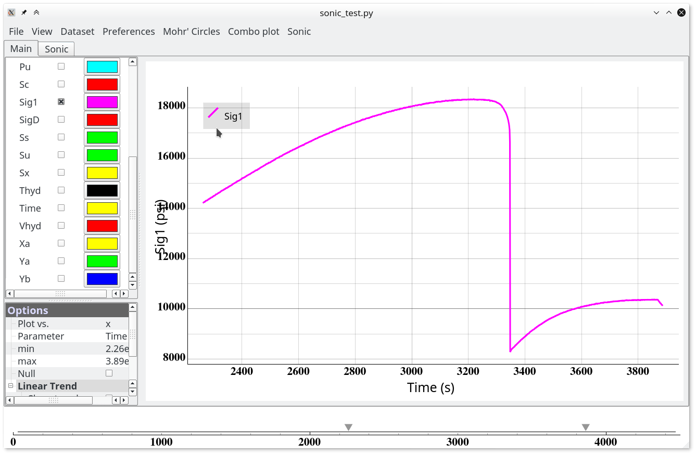
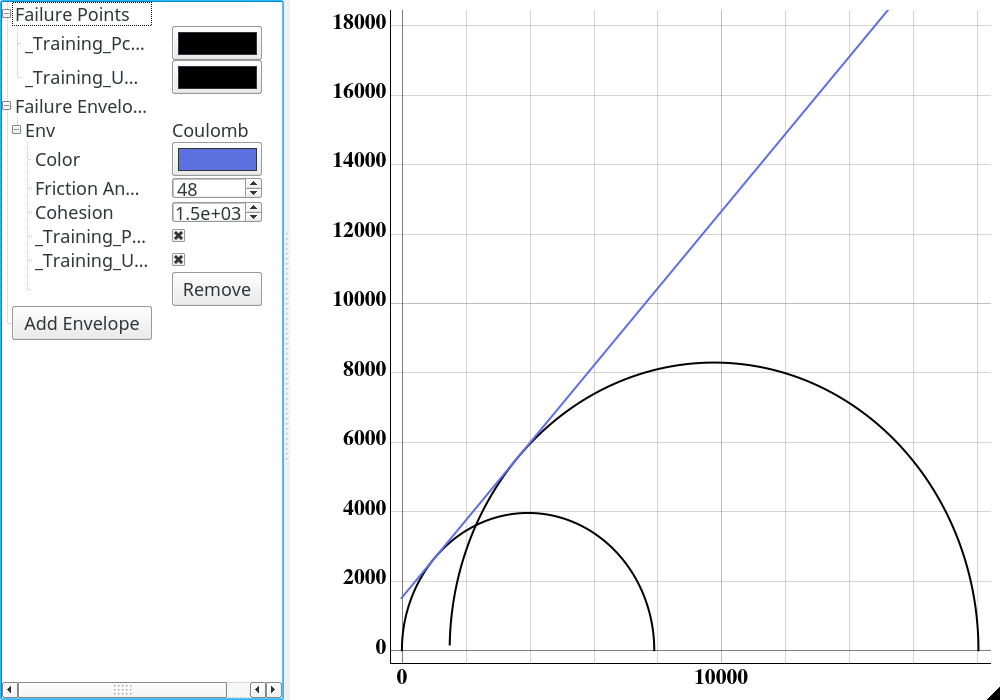
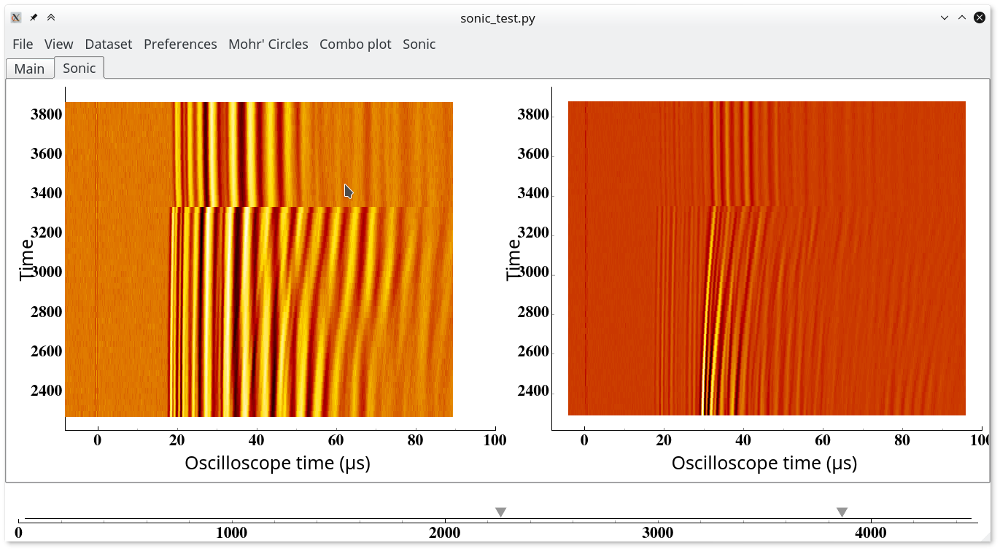
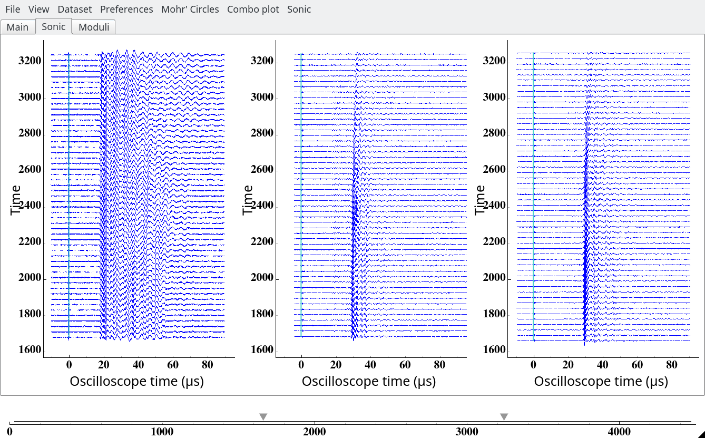
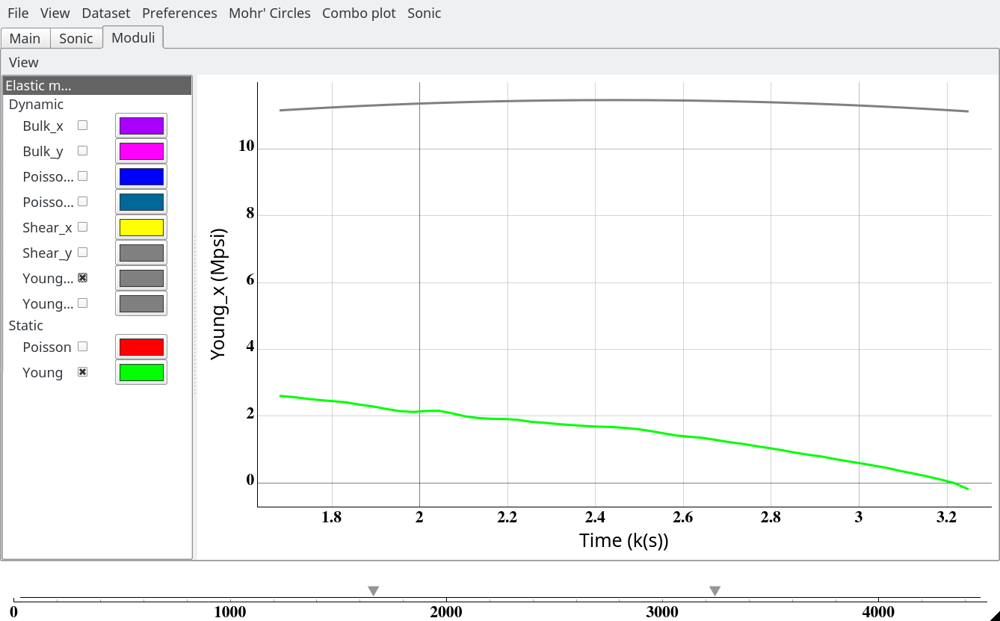

# TCI

## About

TCI is a software developed for visualization and interpretation of the
data produced by Terratek triaxial cell. The current version supports the
import and integration of geomechanical .clf and sonic data for multiple
experiments. The official documentation is currently underway of development,
so should you have any questions or concerns, please contact me.

This software is written in Python 3.5 and needs several libraries to run:
- numpy
- scipy
- PySide
- pyqtgraph
- configobj

## Overview
### Geomechanics
TCI can plot geomechanical data with the subsequent postprocessing.
A completely interactive color palette is easily customizible.
An interactive slider allows narrowing down to the specific time interval.
A built-in trend feature can be used to estimate static moduli.

Mohr circle plugin can automatically match two types of failure criteria to
the failure points.

### Acoustics
Two view modes: wave forms and contours.

Automated calculation of static and dynamic elastic moduli
allows instant and seamless comparison:

## Copyright

TCI (c) by Igor Shovkun

TCI is licensed under a
Creative Commons Attribution 4.0 International License.

You should have received a copy of the license along with this
work. If not, see <http://creativecommons.org/licenses/by/4.0/>.
